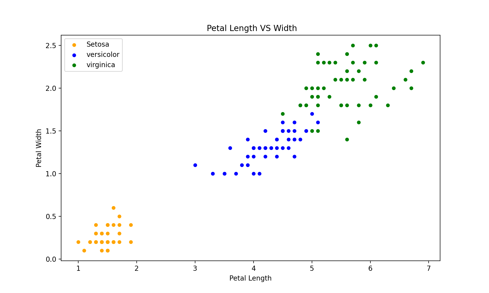
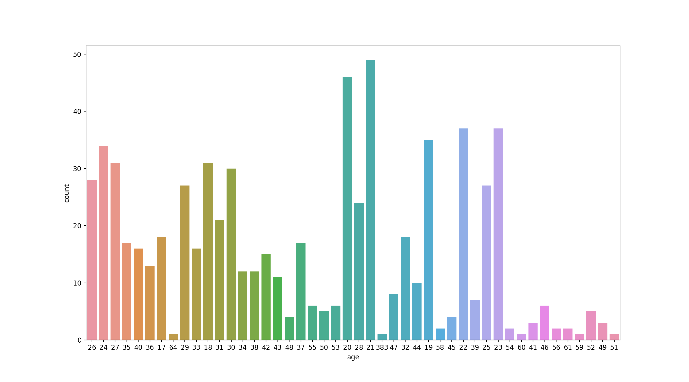
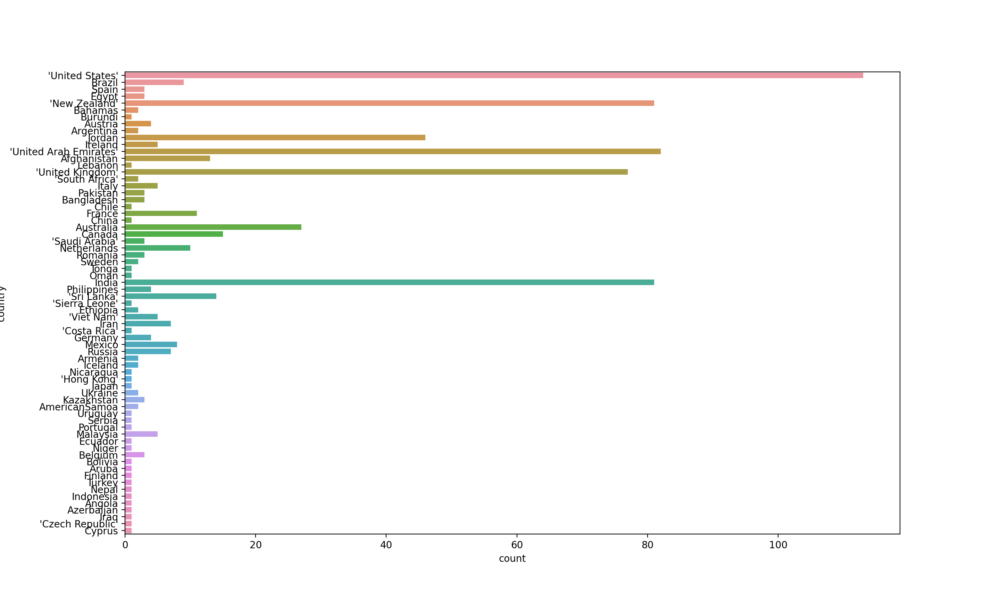
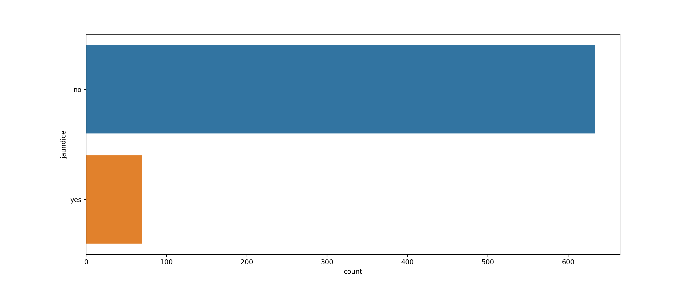
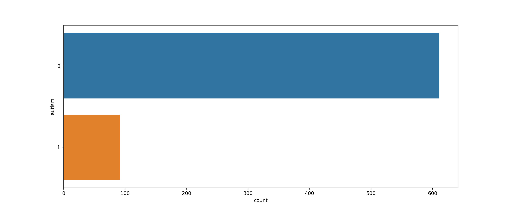
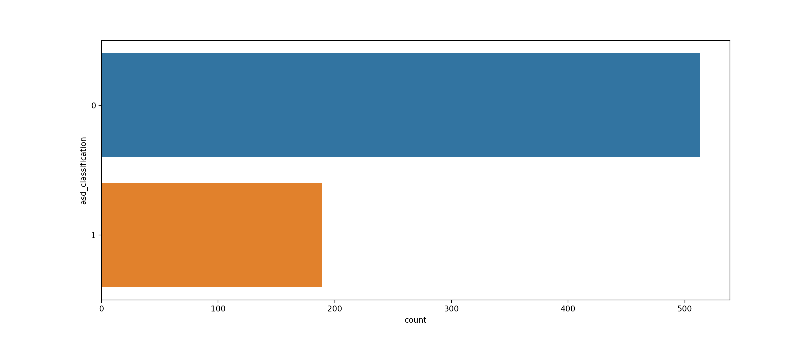
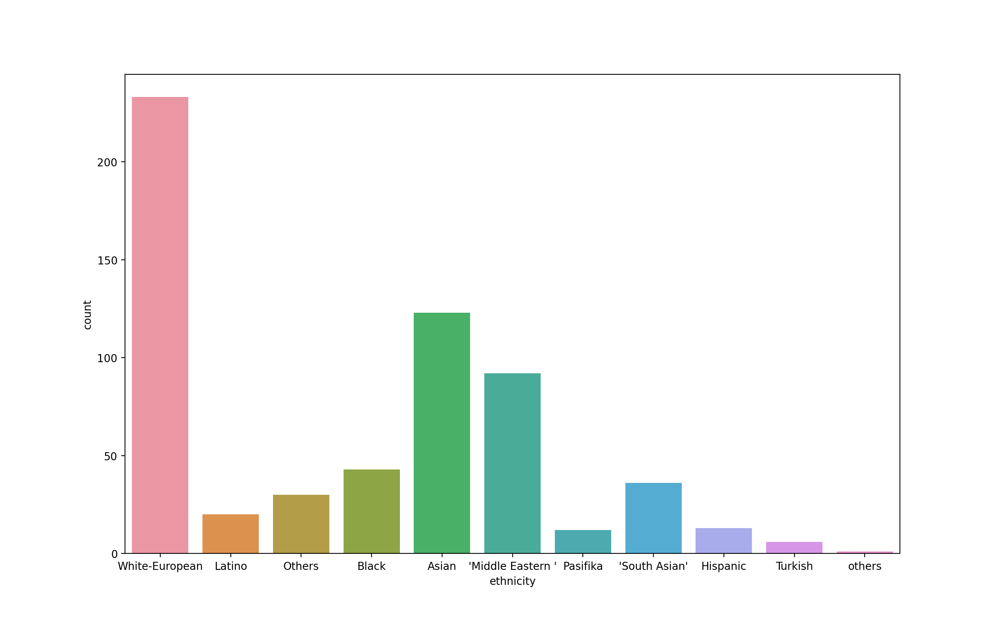
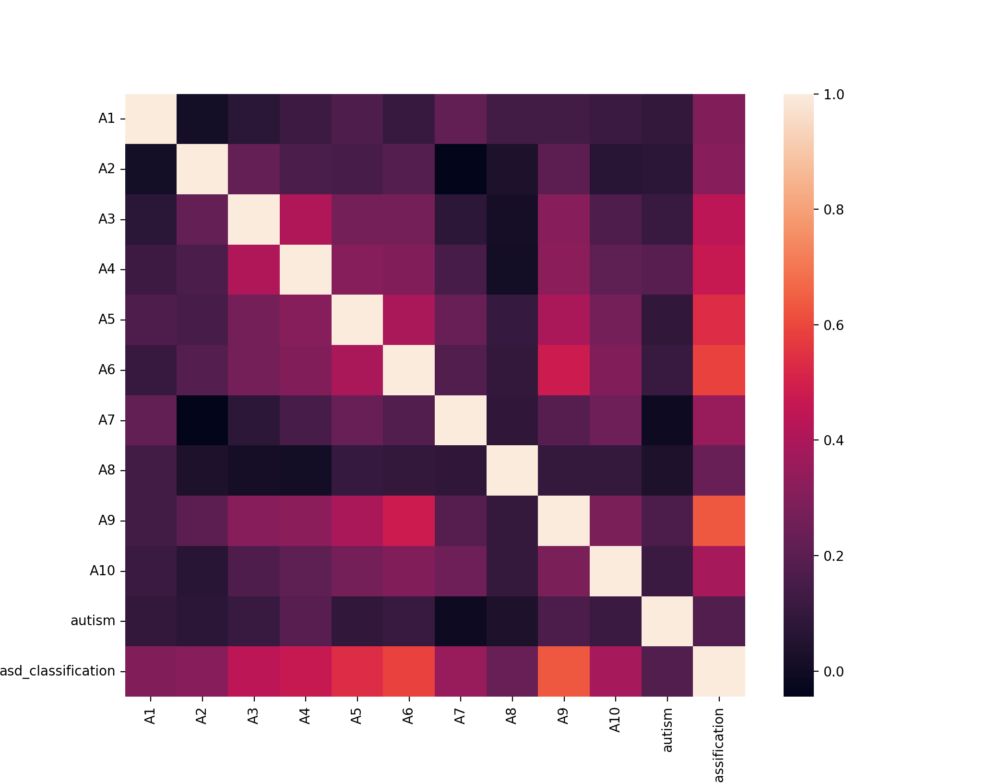

# Energy Consumption in Machine Learning Algorithms 

The project estimates and measures carbon emissions from various Machine Learning datasets to quantify and analyze their impact.

<br/>

- [About Green Coding](#about-Green-Coding)
- [Installation](https://github.com/blessinvarkey/Energy-Consumption-In-Machine-Learning/blob/main/README.md#installation)
- [IRIS-Dataset](https://github.com/blessinvarkey/Estimation-of-Energy-Consumption-In-Machine-Learning/blob/main/README.md#1-iris-dataset)
- [ASD-Screening with AQ-10 Questionaire](https://github.com/blessinvarkey/Estimation-of-Energy-Consumption-In-Machine-Learning/blob/main/README.md#2-autism-spectrum-quotient-aq-10--q-chat)

# About Green Coding 

Green coding is a term recently popularized for its environmental intentions and refers to programming code that is written to produce algorithms that have minimal energy consumption.

The projects in the repo uses code carbon taking into account the computing infrastructure, location, usage and running time


# Installation

Download the project along with a code editor.

Use the terminal to navigate to the source folder. 

Create a virtual environment using `conda` for easier management of dependencies and packages. You can also follow the instructions on the [official conda website](https://docs.conda.io/projects/conda/en/latest/user-guide/install/)

```
conda create --name codecarbon python=3.6
conda activate codecarbon
```

#### Install from PyPI repository
```
pip install codecarbon
```

#### Install from Conda repository

```
conda install -c codecarbon -c conda-forge codecarbon
```

This project requires **Python** and the following Python libraries installed:

- [NumPy](http://www.numpy.org/)
- [Pandas](http://pandas.pydata.org/)
- [matplotlib](http://matplotlib.org/)
- [scikit-learn](http://scikit-learn.org/stable/)

You can install them using 

```
pip install <write the packagename you want to download>
```

To run the code
```
python run.py
```


## 1. Iris Dataset
The IRIS data set contains 3 classes of 50 instances each, where each class refers to a type of iris plant. One class is linearly separable from the other 2; the latter are NOT linearly separable from each other. 

The details on the dataset can be found [here](https://archive.ics.uci.edu/ml/datasets/iris)


### Data Visualization: Sepal Length vs Width & Petal Length vs Width
||||
| ------------- | ------------- |------------- |

| Dataset | Repository | Instance | Algorithm(s) used | Accuracy| Emissions Recorded* (average) |
| ------------- |------------- | ------------- | ------------- | ------------- | ------------- | 
| IRIS Dataset  | UCI Machine Learning Repository | 50 | Logistic Regression, Support Vector Machines | 95.56% (LR), 97.78 (SVM)| 3.2894392230672367e-07kg |


## 2. ASD Screening
The Autism-Spectrum Quotient publisehed by Baron-Cohen, Wheelwright, Skinner, Martin, & Clubley was developed to assess how adults with 'normal' intelligence has the traits associated with autism spectrum conditions. Each question allows the subject to indicate "Definitely agree", "Slightly agree", "Slightly disagree" or "Definitely disagree". Approximately half the questions are worded to elicit an "agree" response from normal individuals, and half to elicit a "disagree" response. The subject scores one point for each question which is answered "autistically" either slightly or definitely." The questions cover five different domains associated with the autism spectrum: social skills; communication skills; imagination; attention to detail; and attention switching/tolerance of change.

According to the dataset, 'Yes' indicates that the individual is on the Autism Spectum and 'No' is indicated when the final score is less than or equal to 7. You can refer the questions from [here](https://www.nice.org.uk/guidance/cg142/resources/autism-spectrum-quotient-aq10-test-pdf-186582493).

The Dataset can be downloaded from the UCI Repository which is publicly available [here](https://archive.ics.uci.edu/ml/datasets/Autism+Screening+Adult). 

### Data Visualization
|||||
| ------------- | ------------- |------------- | ------------- | 
|||||

|||
| ------------- |------------- | 

| Dataset | Repository | Instance| Algorithm(s) used |  Accuracy| Emissions Recorded* (average)|
| ------------- |------------- | ------------- | ------------- | ------------- | ------------- | 
| ASD Screening  | UCI Machine Learning Repository | 761 | Logistic Regression | 99.53% | 8.411635420125923e-07kg | 


[↑ Back to top](https://github.com/blessinvarkey/Estimation-of-Energy-Consumption-In-Machine-Learning/blob/main/README.md#datasets)
